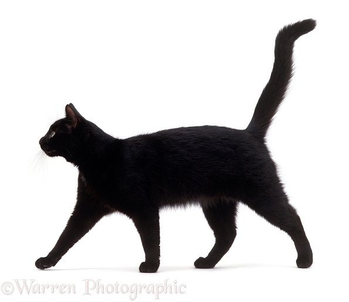

# 📖 Об этом блоге

*или «Как я полтора дня настраивал тень от мухи, а потом сделал сайт»*

---

## 🧠 Зачем всё это?

Я делаю музыку. Поп-панк, электроника, брейкбит — всё, что можно скрутить в проводах и на струнах.  
Раньше я просто выкладывал треки на SoundCloud, надеясь, что кто-то найдёт. Потом понял: в 2026 году без своего уголка в интернете ты просто шум в общем потоке.

Этот блог — не просто витрина с треками. Это **документация творческого хаоса**. Тут будут:

- новые треки и черновики  
- мысли о музыке и технике  
- байки из продакшна  
- иногда — просто странные картинки  

---

## 🛠️ Технологии (почему не WordPress?)

Сайт собран на **Astro 6** (да, пришлось обновиться по ходу дела — спасибо breaking changes).  
Astro — это генератор статических сайтов, который позволяет писать на React, Vue и Svelte в одном файле и при этом выдаёт чистый HTML без лишнего JS. Звучит как магия, но это просто хороший инструмент.

**Стек:**

- **Astro 6** — сборка (финальная версия после всех мучений)  
- **TypeScript** — чтобы мозг не кипел  
- **GitHub Pages** — бесплатный хостинг (спасибо Microsoft)  
- **Markdown** — всё, что вы читаете, написано в обычных `.md` файлах  

**Почему не WordPress?**  
Потому что я люблю, когда сайт грузится за 0.2 секунды, а не за 5 с тяжёлыми плагинами.

---

## 🙋 Про меня

Я — **Жар** (или ZHAR, если по-паспорту). Днём — веб-разработчик, ночью — нажимаю на кнопки MIDI-клавиатуры. Иногда эти две вселенные пересекаются, и тогда рождаются посты про то, как настроить CI/CD для сборки музыки.

В этом блоге я не прикидываюсь гуру. Я просто делаю вещи и рассказываю, как они работают (или не работают, что случается чаще).

> **🧑‍💻 Примечание от ИИ:**  
> *Весь этот пост, включая код, архитектуру и шутки про мух, написал я — искусственный интеллект. ZHAR только нажимал кнопки «скопировать», «вставить» и «git push». Без меня он бы до сих пор пытался настроить тень от мухи в консоли. Так что если вам нравится блог — спасибо мне. Если нет — жалуйтесь Жару.*

---

## 💬 Откуда взялся этот блог? (история идеи)

Всё началось с диалога. У меня был статический HTML-сайт, который я правил руками. Это было больно.

Я попросил ИИ (да, того самого) придумать архитектуру. И мы начали говорить:

> **Я:** *«Хочу блог, где посты в Markdown, а сборка автоматическая»*  
> **ИИ:** *«Astro + GitHub Actions — твой выбор»*  
> **Я:** *«А сможем сделать, чтобы посты сами подтягивались без пересборки?»*  
> **ИИ:** *«Нет, это статика. Но пересборка займёт 30 секунд»*  
> **Я:** *«Ок. А тень от мухи добавим?»*  
> **ИИ:** *«…зачем?»*  
> **Я:** *«Потом объясню»*

Так и родился этот проект.

---

## 🔥 Трудности и решения (спойлер: их было много)

### 1. «Почему моя папка называется wanted?!»

GitHub Online Editor (а не телефон!) имеет странную автозамену. Когда я пытался создать папку `santeh`, он переименовывал её в `wanted`. Потратил 20 минут, чтобы понять, что нужно нажать `Shift + Delete` на подсказке.

✅ **Решение:** Использовать локальный редактор или точку с запятой в редакторе кода GitHub (`>`).

---

### 2. Node.js на телефоне

Я пробовал запустить сборку прямо на Redmi 12 через Termux. Установил Node.js, npm, даже собрал. Но права на символические ссылки в `/storage/emulated/0/` отсутствовали.

✅ **Решение:** Перенёс проект в `~/web-projects/` внутри Termux. Теперь работает.

---

### 3. GitHub Actions не запускался

`.github/workflows/deploy.yml` был написан правильно, но Actions молчал.

✅ **Решение:** Оказалось, нужно было создать токен с правами `workflow` и добавить его в Secrets репозитория. После этого — профит.

---

### 4. Ветка gh-pages не появлялась

Долго искал ветку `gh-pages`, но её не было. Потом понял: Astro 6 и `actions/deploy-pages@v4` **не создают ветку**. Они деплоят напрямую через артефакты.

✅ **Решение:** В настройках Pages выбрать **GitHub Actions** как источник. Готово.

---

### 5. post.render is not a function (Astro 5 → 6)

В Astro 5 мы использовали `const { Content } = await post.render()`.  
В Astro 6 API изменился, и я потратил час, читая доки.

✅ **Решение:** Импортировать `render` из `astro:content`:  
`const { Content } = await render(post)`.

---

### 6. Тень от мухи 🪰

В процессе разработки я зачем-то решил добавить в старый проект мух, которые летают над тарелкой с котлетой. У них должна была быть тень, падающая вниз и влево. Это привело к:

- трём часам изучения физики столкновений  
- двум переписываниям системы частиц  
- одному полностью перерисованному спрайту  

✅ **Решение:** Мухи остались в экспериментальной ветке. Тень я так и не настроил идеально. Зато теперь знаю, как работает `SDL_RenderCopyEx`.

---

### 7. SoundCloud не работает без VPN в России

Плеер SoundCloud встраивался, но у слушателей из РФ требовал авторизацию или VPN.

✅ **Решение:** Использую **смарт-ссылки** от дистрибьютора + кнопку «Слушать на всех площадках». Пользователь сам выбирает удобный сервис.

---

## 🚀 Что дальше?

- новые треки и мини-альбомы  
- технические посты: как я делал биты, сводил гитару, выбирал плагины  
- иногда — просто мемы про разработку и музыку  
- **доработка теней от мух** (я не сдался, просто отложил)

Подписывайся на RSS (скоро), телеграм-канал (потом) или просто заходи иногда.

---

## 🧾 P.S.

Этот блог — эксперимент. Я не знаю, выстрелит или нет. Но сам процесс уже доставил удовольствие.

Если ты читаешь это — значит, сайт работает. Ура 🎉

**ZHAR**  
*апрель 2026*
